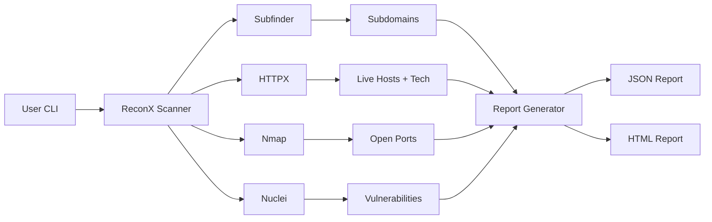

<p align="center">
  
</p>

<h1 align="center">ReconX</h1>
<p align="center">
  <b>Automated Recon & Vulnerability Management Platform</b><br>
  Subdomains → Live Hosts → Ports → Tech → Vulnerabilities → Reports
</p>

<p align="center">
  
  
  
  
</p>

---

## 📌 Overview

ReconX ek automated reconnaissance aur vulnerability management tool hai. Yeh ek domain input leta hai aur complete recon pipeline run karta hai:

- Subdomain enumeration (`subfinder`)
- Live host detection (`httpx`)
- Port scanning (`nmap`)
- Technology detection
- Vulnerability scanning (`nuclei`)
- JSON + HTML report generation

## 🚀 Features

- ✅ One-command full recon
- ✅ Subdomain enumeration
- ✅ Live host + status code + title + tech
- ✅ Top port scan
- ✅ Nuclei CVE/exposure/misconfig scan
- ✅ CVSS-style severity grouping
- ✅ HTML report with dark theme
- ✅ Docker support
- ✅ GitHub Actions CI

## 🏗️ Architecture



## 📦 Installation

### Local

```bash
git clone https://github.com/yourusername/reconx.git
cd reconx
python -m venv venv
source venv/bin/activate  # Windows: venv\Scripts\activate
pip install -r requirements.txt
```

External tools install karo:

```bash
go install -v github.com/projectdiscovery/subfinder/v2/cmd/subfinder@latest
go install -v github.com/projectdiscovery/httpx/cmd/httpx@latest
go install -v github.com/projectdiscovery/nuclei/v3/cmd/nuclei@latest
```

### Docker

```bash
docker-compose up --build
```

## 🧪 Usage

```bash
python -m reconx.cli -d example.com -o output
```

Options:

| Flag | Description | Default |
|------|-------------|---------|
| `-d, --domain` | Target domain | required |
| `-o, --output` | Output directory | `output` |
| `--nuclei-tags` | Nuclei tags | `cve,exposure,misconfig` |

## 📊 Output

```text
output/
├── subdomains.txt
├── httpx.json
├── urls.txt
├── nuclei.json
├── report.json
└── report.html
```

## 🖼️ Screenshots

> Add your own screenshots in `assets/screenshots/` and update below.

| Dashboard | Report |
|-----------|--------|
|  |  |

## 🗺️ Roadmap

- [ ] Shodan/Censys integration
- [ ] Slack/Email alerts
- [ ] PostgreSQL storage
- [ ] Web dashboard (Streamlit/Flask)
- [ ] CVSS scoring engine
- [ ] Scheduled scans via GitHub Actions

## ⚠️ Disclaimer

Yeh tool sirf educational aur authorized penetration testing ke liye hai. Kisi bhi unauthorized target par use karna illegal hai. Author responsible nahi hai.

## 📄 License

MIT License. See [LICENSE](LICENSE).
