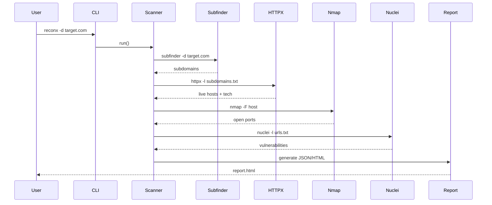

# Architecture

```mermaid
sequenceDiagram
    participant User
    participant CLI
    participant Scanner
    participant Subfinder
    participant HTTPX
    participant Nmap
    participant Nuclei
    participant Report

    User->>CLI: reconx -d target.com
    CLI->>Scanner: run()
    Scanner->>Subfinder: subfinder -d target.com
    Subfinder-->>Scanner: subdomains
    Scanner->>HTTPX: httpx -l subdomains.txt
    HTTPX-->>Scanner: live hosts + tech
    Scanner->>Nmap: nmap -F host
    Nmap-->>Scanner: open ports
    Scanner->>Nuclei: nuclei -l urls.txt
    Nuclei-->>Scanner: vulnerabilities
    Scanner->>Report: generate JSON/HTML
    Report-->>User: report.html
```
